# DeerFlow 接口时序图

本文档基于新的数据库表结构设计，描述了 DeerFlow 系统主要业务流程的时序图。

## 数据库架构说明

- **flow 数据库**：存储用户、工作空间、线程、Agent、Skill、Memory 等业务数据
- **check_point 数据库**：存储 LangGraph 对话状态检查点
- **OSS 对象存储**：作为文件与 Skill 内容的主存储
- **Docker 运行时**：通过容器内挂载的对象存储目录访问 workspace 与 skills

## 1. 用户注册与登录流程

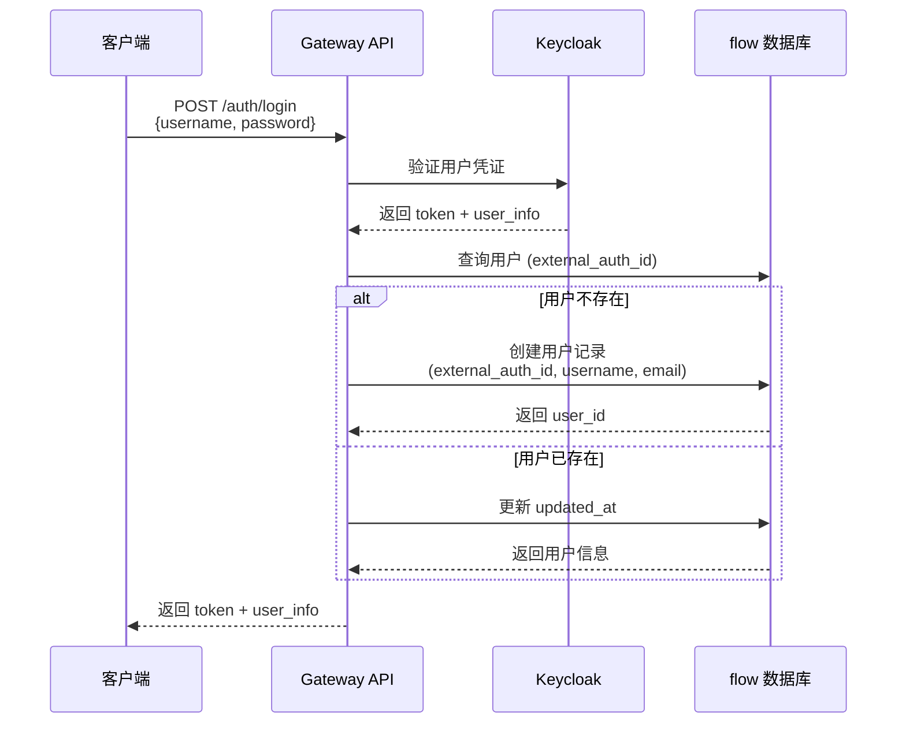
```mermaid
sequenceDiagram
    participant Client as 客户端
    participant Gateway as Gateway API
    participant Keycloak as Keycloak
    participant DB as flow 数据库
    
    Client->>Gateway: POST /auth/login<br/>{username, password}
    Gateway->>Keycloak: 验证用户凭证
    Keycloak-->>Gateway: 返回 token + user_info
    
    Gateway->>DB: 查询用户 (external_auth_id)
    
    alt 用户不存在
        Gateway->>DB: 创建用户记录<br/>(external_auth_id, username, email)
        DB-->>Gateway: 返回 user_id
    else 用户已存在
        Gateway->>DB: 更新 updated_at
        DB-->>Gateway: 返回用户信息
    end
    
    Gateway-->>Client: 返回 token + user_info
```

---

## 2. 创建线程流程（自动创建工作空间）

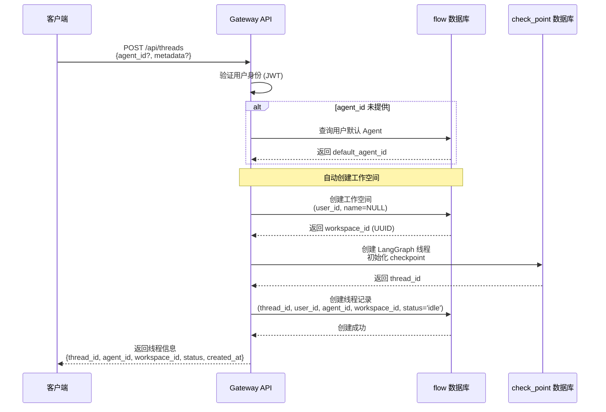
```mermaid
sequenceDiagram
    participant Client as 客户端
    participant Gateway as Gateway API
    participant FlowDB as flow 数据库
    participant CheckDB as check_point 数据库
    
    Client->>Gateway: POST /api/threads<br/>{agent_id?, metadata?}
    Gateway->>Gateway: 验证用户身份 (JWT)
    
    alt agent_id 未提供
        Gateway->>FlowDB: 查询用户默认 Agent
        FlowDB-->>Gateway: 返回 default_agent_id
    end
    
    Note over Gateway,FlowDB: 自动创建工作空间
    Gateway->>FlowDB: 创建工作空间<br/>(user_id, name=NULL)
    FlowDB-->>Gateway: 返回 workspace_id (UUID)
    
    Gateway->>CheckDB: 创建 LangGraph 线程<br/>初始化 checkpoint
    CheckDB-->>Gateway: 返回 thread_id
    
    Gateway->>FlowDB: 创建线程记录<br/>(thread_id, user_id, agent_id, workspace_id, status='idle')
    FlowDB-->>Gateway: 创建成功
    
    Gateway-->>Client: 返回线程信息<br/>{thread_id, agent_id, workspace_id, status, created_at}
```

**关键点**:
- 创建线程时必须指定 agent_id，若未提供则使用用户默认 Agent
- 自动创建一个关联的 workspace
- workspace.name 默认为 NULL
- 每个线程都有独立的 workspace

---

## 3. 上传文件到工作区(客户端直传 OSS)

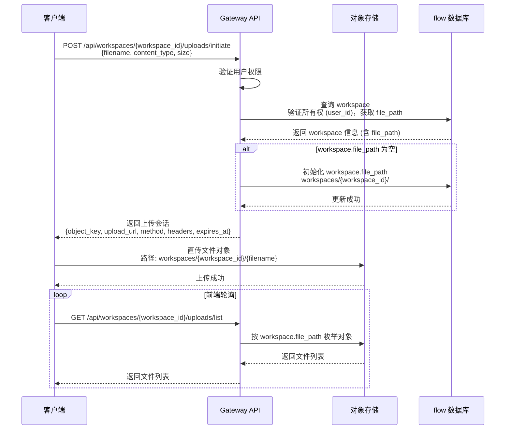
```mermaid
sequenceDiagram
    participant Client as 客户端
    participant Gateway as Gateway API
    participant OSS as 对象存储
    participant DB as flow 数据库
    
    Client->>Gateway: POST /api/workspaces/{workspace_id}/uploads/initiate<br/>{filename, content_type, size}
    Gateway->>Gateway: 验证用户权限
    
    Gateway->>DB: 查询 workspace<br/>验证所有权 (user_id)，获取 file_path
    DB-->>Gateway: 返回 workspace 信息 (含 file_path)
    
    alt workspace.file_path 为空
        Gateway->>DB: 初始化 workspace.file_path<br/>workspaces/{workspace_id}/
        DB-->>Gateway: 更新成功
    end
    
    Gateway-->>Client: 返回上传会话<br/>{object_key, upload_url, method, headers, expires_at}
    
    Client->>OSS: 直传文件对象<br/>路径: workspaces/{workspace_id}/{filename}
    OSS-->>Client: 上传成功
    
    loop 前端轮询
        Client->>Gateway: GET /api/workspaces/{workspace_id}/uploads/list
        Gateway->>OSS: 按 workspace.file_path 枚举对象
        OSS-->>Gateway: 返回文件列表
        Gateway-->>Client: 返回文件列表
    end
```

**关键点**:
- 主上传入口: `POST /api/workspaces/{workspace_id}/uploads/initiate`
- 文件列表查询: `GET /api/workspaces/{workspace_id}/uploads/list`
- 文件主存储在 OSS,Gateway 只负责鉴权和签发上传会话,不再代理文件字节流
- `workspaces.file_path` 存储 workspace 的 OSS 根前缀
- 第一版取消 PDF/Office 自动转 Markdown
- Docker 容器通过挂载后的对象存储目录继续提供 `/mnt/user-data/uploads/...` 访问语义

---

## 4. 查询工作区文件列表(OSS)

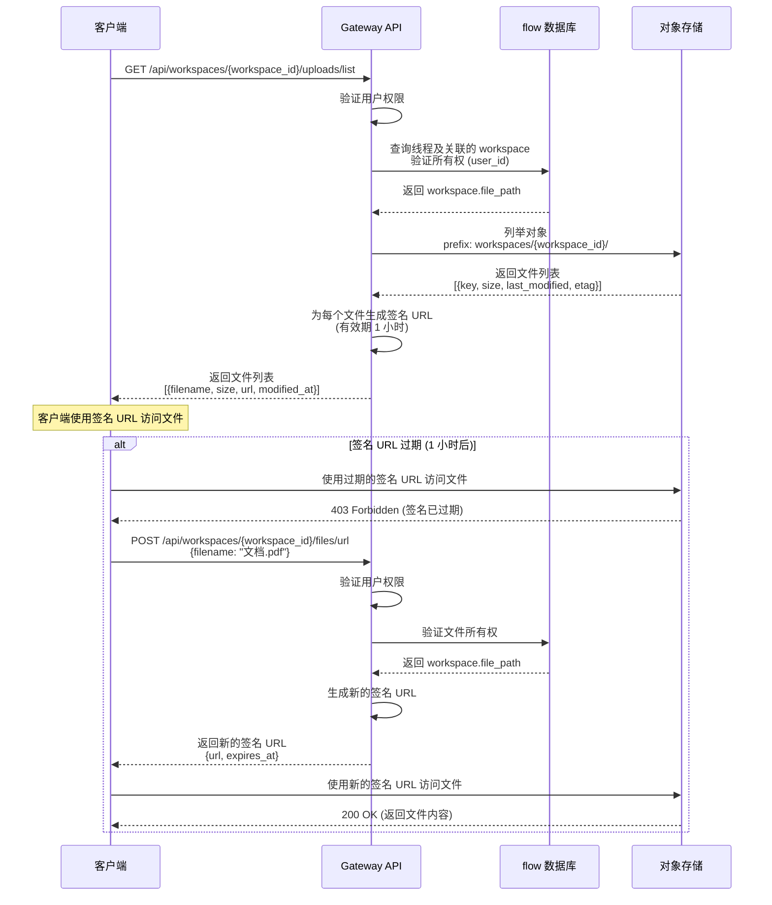
```mermaid
sequenceDiagram
    participant Client as 客户端
    participant Gateway as Gateway API
    participant FlowDB as flow 数据库
    participant OSS as 对象存储
    
    Client->>Gateway: GET /api/workspaces/{workspace_id}/uploads/list
    Gateway->>Gateway: 验证用户权限
    
    Gateway->>FlowDB: 查询线程及关联的 workspace<br/>验证所有权 (user_id)
    FlowDB-->>Gateway: 返回 workspace.file_path<br/>
    
    Gateway->>OSS: 列举对象<br/>prefix: workspaces/{workspace_id}/
    OSS-->>Gateway: 返回文件列表<br/>[{key, size, last_modified, etag}]
    
    Gateway->>Gateway: 为每个文件生成签名 URL<br/>(有效期 1 小时)
    
    Gateway-->>Client: 返回文件列表<br/>[{filename, size, url, modified_at}]
    
    Note over Client: 客户端使用签名 URL 访问文件
    
    alt 签名 URL 过期 (1 小时后)
        Client->>OSS: 使用过期的签名 URL 访问文件
        OSS-->>Client: 403 Forbidden (签名已过期)
        
        Client->>Gateway: POST /api/workspaces/{workspace_id}/files/url<br/>{filename: "文档.pdf"}
        Gateway->>Gateway: 验证用户权限
        Gateway->>FlowDB: 验证文件所有权
        FlowDB-->>Gateway: 返回 workspace.file_path
        Gateway->>Gateway: 生成新的签名 URL
        Gateway-->>Client: 返回新的签名 URL<br/>{url, expires_at}
        
        Client->>OSS: 使用新的签名 URL 访问文件
        OSS-->>Client: 200 OK (返回文件内容)
    end
```

**关键点**:
- 列表接口: `GET /api/workspaces/{workspace_id}/files`
- 单文件 URL 刷新接口: `POST /api/workspaces/{workspace_id}/files/url`,请求体: `{filename: "文件名.pdf"}`
- 使用 POST 请求可避免 URL 中中文文件名的编码问题
- `workspace.file_path` 存储 workspace 在 OSS 中的根目录前缀,如 `workspaces/{workspace_id}/`
- 通过该前缀列举 OSS 中的所有文件
- 返回每个文件的签名 URL,客户端可直接访问
- 签名 URL 默认有效期 1 小时,过期后调用单文件接口刷新该文件的签名 URL
- 客户端收到 403 错误时,只需刷新对应文件的 URL,无需重新获取整个列表
- 文件元数据包含:文件名、大小、修改时间、访问 URL

---

## 5. 查询线程历史消息

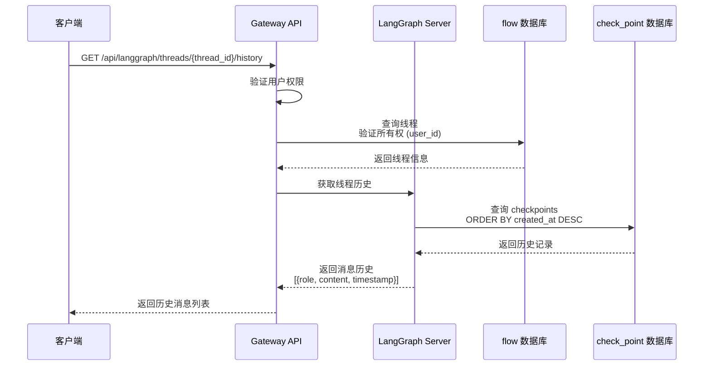
```mermaid
sequenceDiagram
    participant Client as 客户端
    participant Gateway as Gateway API
    participant LangGraph as LangGraph Server
    participant FlowDB as flow 数据库
    participant CheckDB as check_point 数据库
    
    Client->>Gateway: GET /api/langgraph/threads/{thread_id}/history
    Gateway->>Gateway: 验证用户权限
    
    Gateway->>FlowDB: 查询线程<br/>验证所有权 (user_id)
    FlowDB-->>Gateway: 返回线程信息
    
    Gateway->>LangGraph: 获取线程历史
    LangGraph->>CheckDB: 查询 checkpoints<br/>ORDER BY created_at DESC
    CheckDB-->>LangGraph: 返回历史记录
    
    LangGraph-->>Gateway: 返回消息历史<br/>[{role, content, timestamp}]
    
    Gateway-->>Client: 返回历史消息列表
```

**关键点**:
- 接口路径：`GET /api/langgraph/threads/{thread_id}/history`
- 从 check_point 数据库查询历史记录
- 按时间倒序返回
- 包含用户消息和 AI 响应

---

## 5. 发送消息并获取响应（Stream）

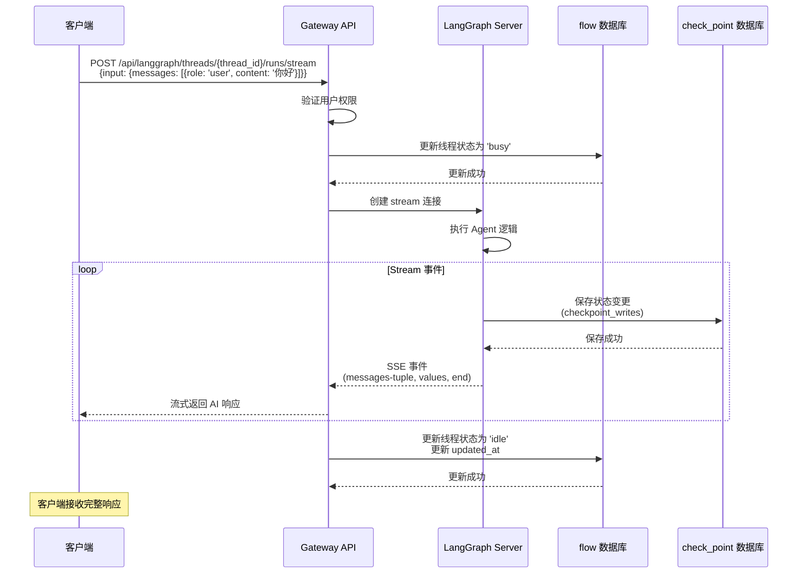
```mermaid
sequenceDiagram
    participant Client as 客户端
    participant Gateway as Gateway API
    participant LangGraph as LangGraph Server
    participant FlowDB as flow 数据库
    participant CheckDB as check_point 数据库
    
    Client->>Gateway: POST /api/langgraph/threads/{thread_id}/runs/stream<br/>{input: {messages: [{role: 'user', content: '你好'}]}}
    Gateway->>Gateway: 验证用户权限
    
    Gateway->>FlowDB: 更新线程状态为 'busy'
    FlowDB-->>Gateway: 更新成功
    
    Gateway->>LangGraph: 创建 stream 连接
    LangGraph->>LangGraph: 执行 Agent 逻辑
    
    loop Stream 事件
        LangGraph->>CheckDB: 保存状态变更<br/>(checkpoint_writes)
        CheckDB-->>LangGraph: 保存成功
        
        LangGraph-->>Gateway: SSE 事件<br/>(messages-tuple, values, end)
        Gateway-->>Client: 流式返回 AI 响应
    end
    
    Gateway->>FlowDB: 更新线程状态为 'idle'<br/>更新 updated_at
    FlowDB-->>Gateway: 更新成功
    
    Note over Client: 客户端接收完整响应
```

**关键点**:
- 接口路径：`POST /api/langgraph/threads/{thread_id}/runs/stream`
- 使用 SSE (Server-Sent Events) 流式返回
- 事件类型：messages-tuple（消息更新）、values（状态更新）、end（结束）
- 实时返回 AI 生成的内容

---

## 6. 创建 Skill（直传 OSS + finalize 同步校验）

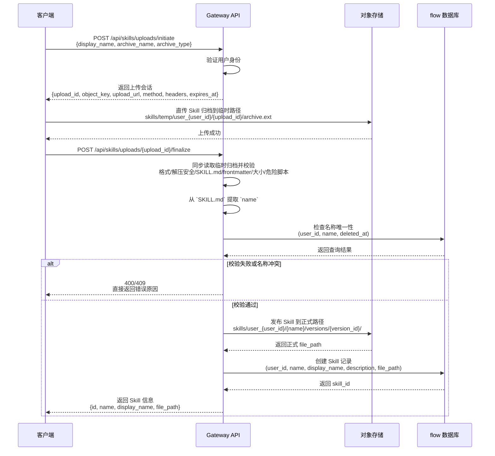
```mermaid
sequenceDiagram
    participant Client as 客户端
    participant Gateway as Gateway API
    participant OSS as 对象存储
    participant DB as flow 数据库
    
    Client->>Gateway: POST /api/skills/uploads/initiate<br/>{display_name, archive_name, archive_type}
    Gateway->>Gateway: 验证用户身份
    Gateway-->>Client: 返回上传会话<br/>{upload_id, object_key, upload_url, method, headers, expires_at}
    
    Client->>OSS: 直传 Skill 归档到临时路径<br/>skills/temp/user_{user_id}/{upload_id}/archive.ext
    OSS-->>Client: 上传成功
    
    Client->>Gateway: POST /api/skills/uploads/{upload_id}/finalize
    Gateway->>Gateway: 同步读取临时归档并校验<br/>格式/解压安全/SKILL.md/frontmatter/大小/危险脚本
    Gateway->>Gateway: 从 `SKILL.md` 提取 `name`
    
    Gateway->>DB: 检查名称唯一性<br/>(user_id, name, deleted_at)
    DB-->>Gateway: 返回查询结果
    
    alt 校验失败或名称冲突
        Gateway-->>Client: 400/409<br/>直接返回错误原因
    else 校验通过
        Gateway->>OSS: 发布 Skill 到正式路径<br/>skills/user_{user_id}/{name}/versions/{version_id}/
        OSS-->>Gateway: 返回正式 file_path
        
        Gateway->>DB: 创建 Skill 记录<br/>(user_id, name, display_name, description, file_path)
        DB-->>Gateway: 返回 skill_id
        
        Gateway-->>Client: 返回 Skill 信息<br/>{id, name, display_name, file_path}
    end
```

**关键点**:
- 用户先直传 Skill 归档到 OSS 临时路径，再由客户端主动调用 `finalize`
- `finalize` 在单个同步请求内完成权威校验，失败直接返回错误，不新增 `skill_upload_tasks`
- `name` 从归档内的 `SKILL.md` 中解析得到
- 仅接受归档格式（`.zip`、`.tar.gz`、`.tgz`）
- 数据库存储 `file_path`，表示当前生效版本的 Skill 根前缀
- `user_id = NULL` 表示系统级 Skill（管理员创建）

---

## 7. 查询 Skill 列表

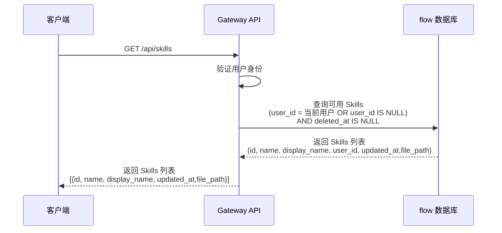
```mermaid
sequenceDiagram
    participant Client as 客户端
    participant Gateway as Gateway API
    participant DB as flow 数据库
    
    Client->>Gateway: GET /api/skills
    Gateway->>Gateway: 验证用户身份
    
    Gateway->>DB: 查询可用 Skills<br/>(user_id = 当前用户 OR user_id IS NULL)<br/>AND deleted_at IS NULL
    DB-->>Gateway: 返回 Skills 列表<br/>(id, name, display_name, user_id, updated_at,file_path)
    
    Gateway-->>Client: 返回 Skills 列表<br/>[{id, name, display_name, updated_at,file_path}]
```

**关键点**:
- 该接口返回当前用户可见的全部 Skills，包括用户级和系统级
- 列表接口只返回展示所需元信息，不返回 Skill 文件夹内容
- 只有 `finalize` 成功并写入数据库的 Skill 才会出现在列表中；临时上传对象不会暴露给用户
- 可通过 `scope=user|system` 区分技能来源

---

## 8. 修改 Skill（上传新版本）

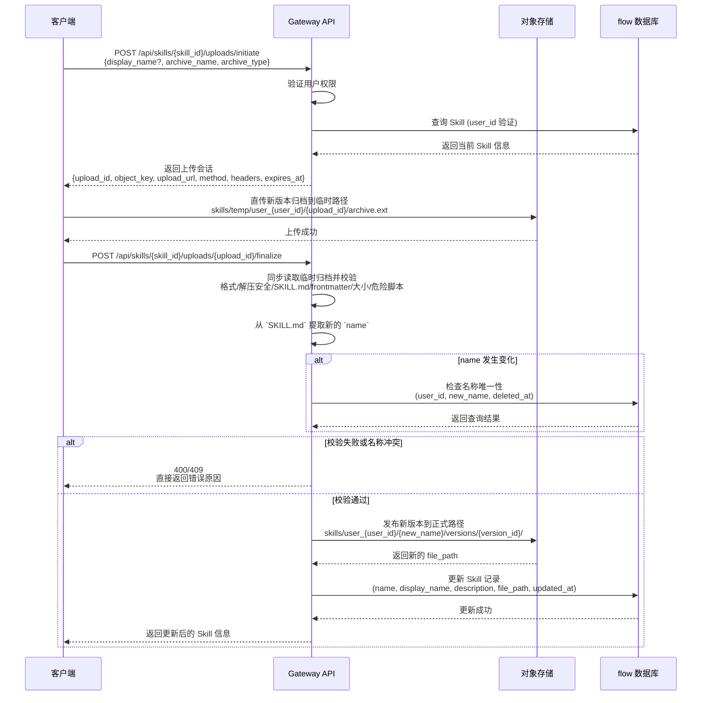
```mermaid
sequenceDiagram
    participant Client as 客户端
    participant Gateway as Gateway API
    participant OSS as 对象存储
    participant DB as flow 数据库
    
    Client->>Gateway: POST /api/skills/{skill_id}/uploads/initiate<br/>{display_name?, archive_name, archive_type}
    Gateway->>Gateway: 验证用户权限
    
    Gateway->>DB: 查询 Skill (user_id 验证)
    DB-->>Gateway: 返回当前 Skill 信息
    
    Gateway-->>Client: 返回上传会话<br/>{upload_id, object_key, upload_url, method, headers, expires_at}
    
    Client->>OSS: 直传新版本归档到临时路径<br/>skills/temp/user_{user_id}/{upload_id}/archive.ext
    OSS-->>Client: 上传成功
    
    Client->>Gateway: POST /api/skills/{skill_id}/uploads/{upload_id}/finalize
    Gateway->>Gateway: 同步读取临时归档并校验<br/>格式/解压安全/SKILL.md/frontmatter/大小/危险脚本
    Gateway->>Gateway: 从 `SKILL.md` 提取新的 `name`
    
    alt name 发生变化
        Gateway->>DB: 检查名称唯一性<br/>(user_id, new_name, deleted_at)
        DB-->>Gateway: 返回查询结果
    end
    
    alt 校验失败或名称冲突
        Gateway-->>Client: 400/409<br/>直接返回错误原因
    else 校验通过
        Gateway->>OSS: 发布新版本到正式路径<br/>skills/user_{user_id}/{new_name}/versions/{version_id}/
        OSS-->>Gateway: 返回新的 file_path
        
        Gateway->>DB: 更新 Skill 记录<br/>(name, display_name, description, file_path, updated_at)
        DB-->>Gateway: 更新成功
        
        Gateway-->>Client: 返回更新后的 Skill 信息
    end
```

**关键点**:
- 修改 Skill 的主链路改为 `initiate + 直传归档 + finalize`
- 只有 `finalize` 成功后才会切换到新版本；旧版本在此之前持续可用
- 如果 `SKILL.md` 中的 `name` 发生变化，需要重新做唯一性校验
- 同步校验失败直接返回错误，不更新现有 Skill 记录
- 修改 Skill 只允许操作用户自己的 Skill，不允许修改系统级 Skill

---

## 9. 删除 Skill

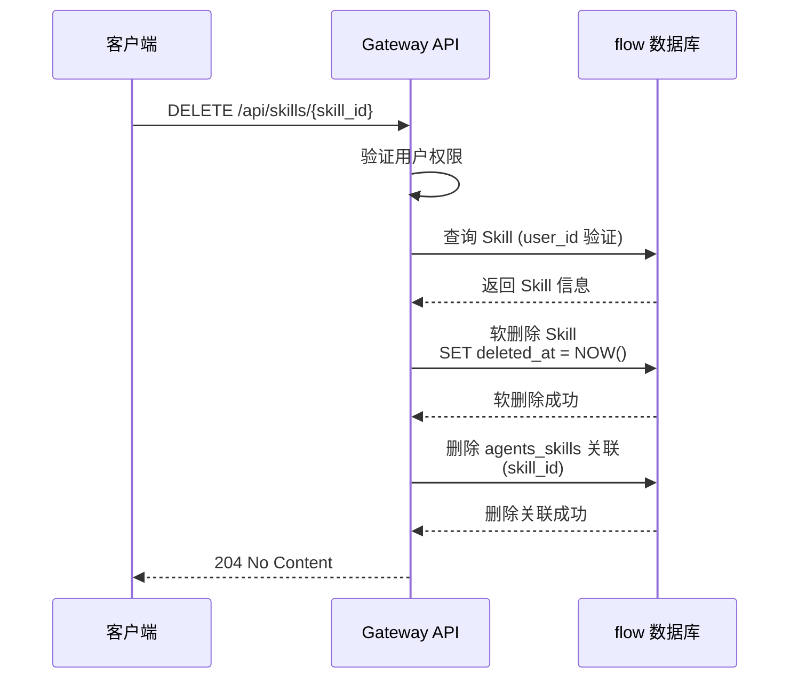
```mermaid
sequenceDiagram
    participant Client as 客户端
    participant Gateway as Gateway API
    participant DB as flow 数据库
    
    Client->>Gateway: DELETE /api/skills/{skill_id}
    Gateway->>Gateway: 验证用户权限
    
    Gateway->>DB: 查询 Skill (user_id 验证)
    DB-->>Gateway: 返回 Skill 信息
    
    Gateway->>DB: 软删除 Skill<br/>SET deleted_at = NOW()
    DB-->>Gateway: 软删除成功
    
    Gateway->>DB: 删除 agents_skills 关联<br/>(skill_id)
    DB-->>Gateway: 删除关联成功
    
    Gateway-->>Client: 204 No Content
```

**关键点**:
- Skill 删除使用软删除
- 删除 Skill 后同步清理 `agents_skills` 关联记录
- 已删除 Skill 不再出现在 Skill 列表和 Agent 绑定候选项中

---

## 10. 创建 Agent

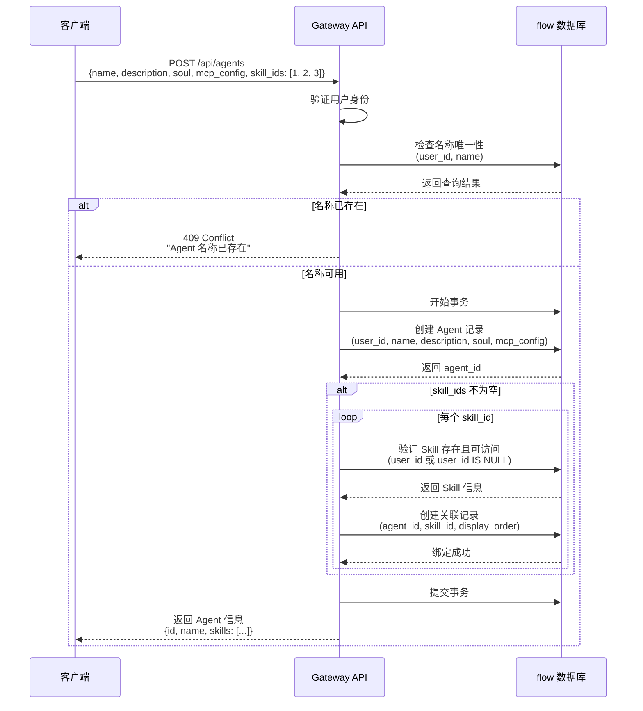
```mermaid
sequenceDiagram
    participant Client as 客户端
    participant Gateway as Gateway API
    participant DB as flow 数据库
    
    Client->>Gateway: POST /api/agents<br/>{name, description, soul, mcp_config, skill_ids: [1, 2, 3]}
    Gateway->>Gateway: 验证用户身份
    
    Gateway->>DB: 检查名称唯一性<br/>(user_id, name)
    DB-->>Gateway: 返回查询结果
    
    alt 名称已存在
        Gateway-->>Client: 409 Conflict<br/>"Agent 名称已存在"
    else 名称可用
        Gateway->>DB: 开始事务
        
        Gateway->>DB: 创建 Agent 记录<br/>(user_id, name, description, soul, mcp_config)
        DB-->>Gateway: 返回 agent_id
        
        alt skill_ids 不为空
            loop 每个 skill_id
                Gateway->>DB: 验证 Skill 存在且可访问<br/>(user_id 或 user_id IS NULL)
                DB-->>Gateway: 返回 Skill 信息
                
                Gateway->>DB: 创建关联记录<br/>(agent_id, skill_id, display_order)
                DB-->>Gateway: 绑定成功
            end
        end
        
        Gateway->>DB: 提交事务
        
        Gateway-->>Client: 返回 Agent 信息<br/>{id, name, skills: [...]}
    end
```

**关键点**:
- 创建 Agent 时直接传入 `skill_ids` 数组
- 使用事务保证 Agent 和 Skills 关联的原子性
- 验证每个 Skill 的访问权限（用户级或系统级）
- `soul` 和 `mcp_config` 直接存储在数据库
- 唯一约束：`(user_id, name)`

---

## 11. 查询 Agent

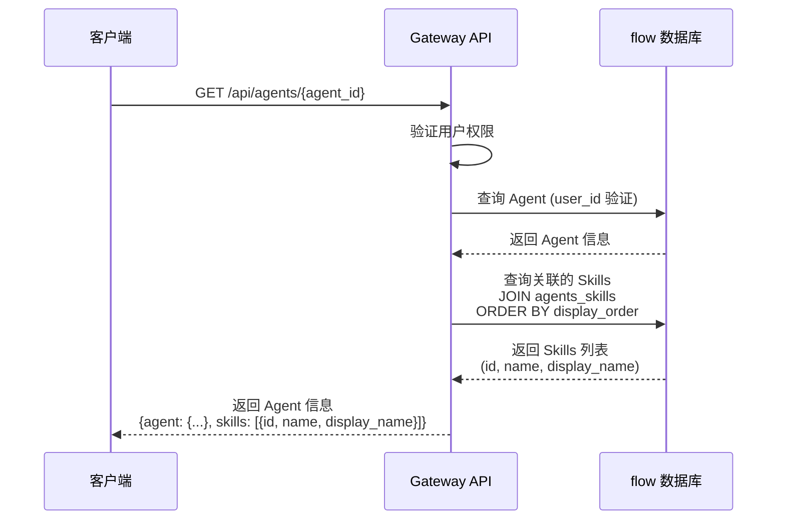
```mermaid
sequenceDiagram
    participant Client as 客户端
    participant Gateway as Gateway API
    participant DB as flow 数据库
    
    Client->>Gateway: GET /api/agents/{agent_id}
    Gateway->>Gateway: 验证用户权限
    
    Gateway->>DB: 查询 Agent (user_id 验证)
    DB-->>Gateway: 返回 Agent 信息
    
    Gateway->>DB: 查询关联的 Skills<br/>JOIN agents_skills<br/>ORDER BY display_order
    DB-->>Gateway: 返回 Skills 列表<br/>(id, name, display_name)
    
    Gateway-->>Client: 返回 Agent 信息<br/>{agent: {...}, skills: [{id, name, display_name}]}
```

**关键点**:
- 该接口仅返回 Agent 绑定的 Skill 展示信息
- Skills 列表只需要返回文件名/显示名，不返回 Skill 文件内容
- 查询 Agent 详情时不访问 OSS 下载 Skill 文件夹

---

## 12. 修改 Agent

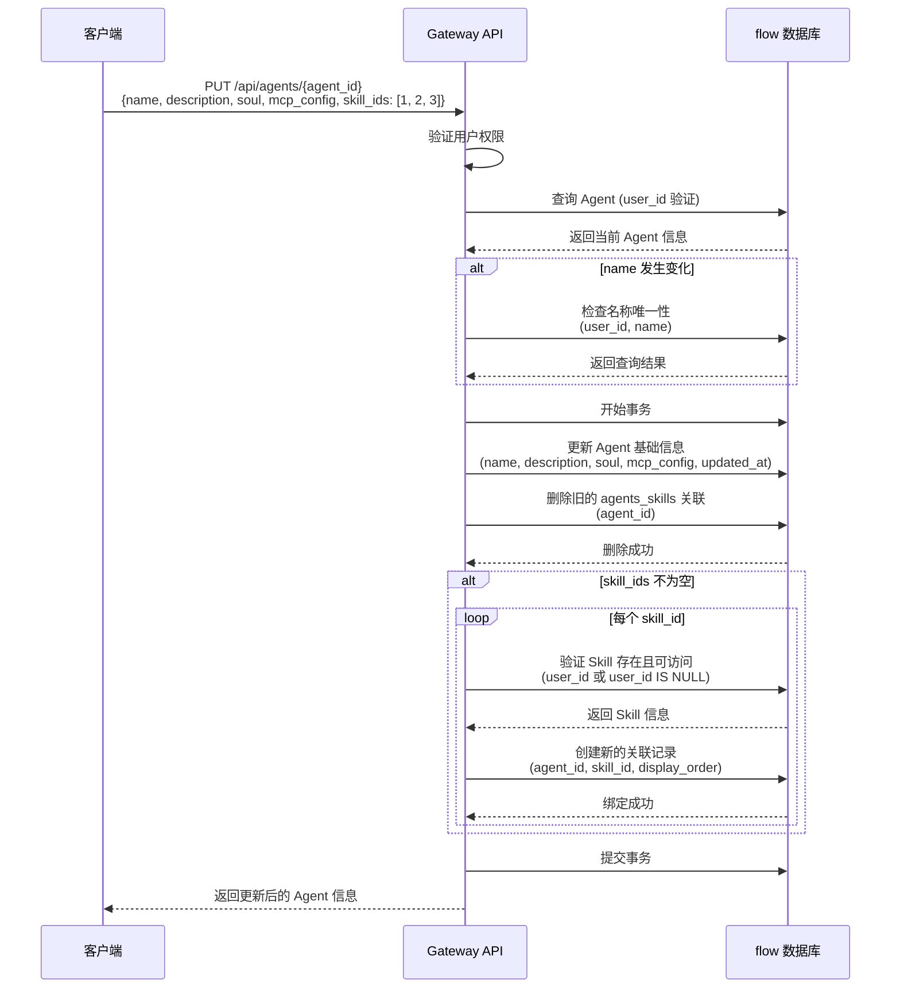
```mermaid
sequenceDiagram
    participant Client as 客户端
    participant Gateway as Gateway API
    participant DB as flow 数据库
    
    Client->>Gateway: PUT /api/agents/{agent_id}<br/>{name, description, soul, mcp_config, skill_ids: [1, 2, 3]}
    Gateway->>Gateway: 验证用户权限
    
    Gateway->>DB: 查询 Agent (user_id 验证)
    DB-->>Gateway: 返回当前 Agent 信息
    
    alt name 发生变化
        Gateway->>DB: 检查名称唯一性<br/>(user_id, name)
        DB-->>Gateway: 返回查询结果
    end
    
    Gateway->>DB: 开始事务
    Gateway->>DB: 更新 Agent 基础信息<br/>(name, description, soul, mcp_config, updated_at)
    
    Gateway->>DB: 删除旧的 agents_skills 关联<br/>(agent_id)
    DB-->>Gateway: 删除成功
    
    alt skill_ids 不为空
        loop 每个 skill_id
            Gateway->>DB: 验证 Skill 存在且可访问<br/>(user_id 或 user_id IS NULL)
            DB-->>Gateway: 返回 Skill 信息
            
            Gateway->>DB: 创建新的关联记录<br/>(agent_id, skill_id, display_order)
            DB-->>Gateway: 绑定成功
        end
    end
    
    Gateway->>DB: 提交事务
    Gateway-->>Client: 返回更新后的 Agent 信息
```

**关键点**:
- 修改 Agent 时支持同时更新基础信息和绑定的 Skills
- 通过“先删旧关联，再按新顺序重建”保证 `display_order` 一致
- 更新 Agent 与更新 Skills 关联放在同一事务内

---

## 13. 更新用户记忆

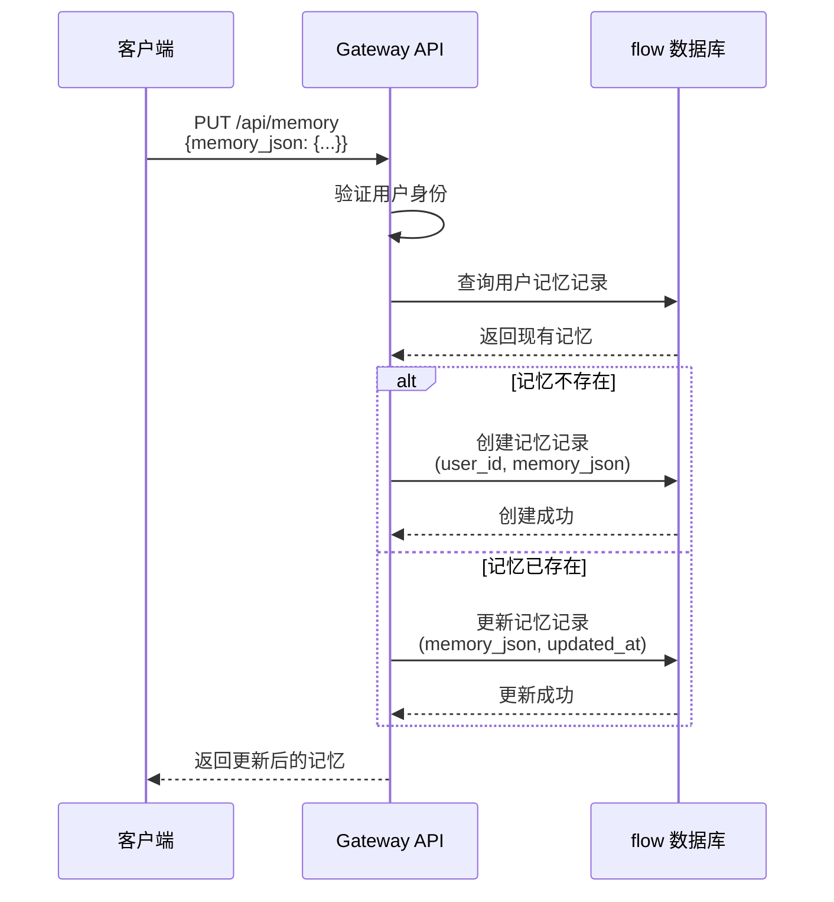
```mermaid
sequenceDiagram
    participant Client as 客户端
    participant Gateway as Gateway API
    participant DB as flow 数据库
    
    Client->>Gateway: PUT /api/memory<br/>{memory_json: {...}}
    Gateway->>Gateway: 验证用户身份
    
    Gateway->>DB: 查询用户记忆记录
    DB-->>Gateway: 返回现有记忆
    
    alt 记忆不存在
        Gateway->>DB: 创建记忆记录<br/>(user_id, memory_json)
        DB-->>Gateway: 创建成功
    else 记忆已存在
        Gateway->>DB: 更新记忆记录<br/>(memory_json, updated_at)
        DB-->>Gateway: 更新成功
    end
    
    Gateway-->>Client: 返回更新后的记忆
```

**关键点**:
- `memory_json` 存储为 JSONB 类型
- 每个用户只有一条记忆记录

---

## 14. 软删除资源流程

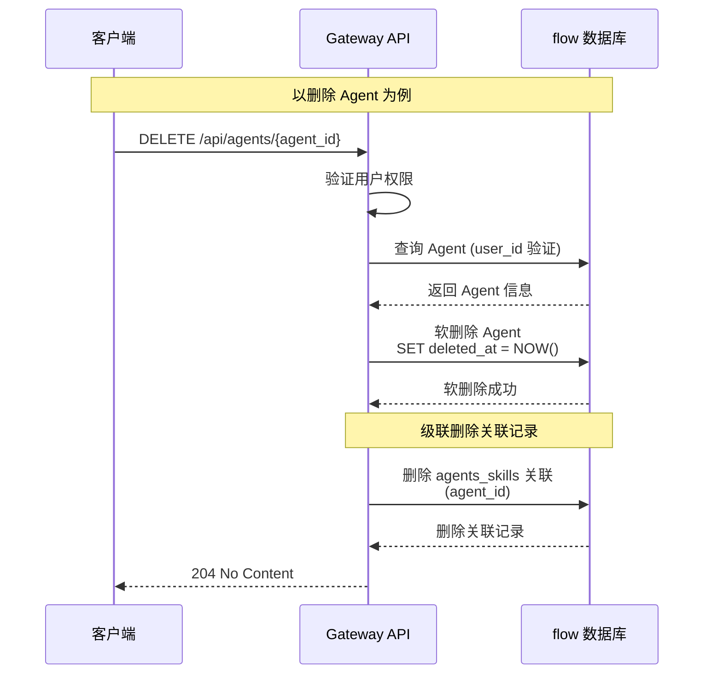
```mermaid
sequenceDiagram
    participant Client as 客户端
    participant Gateway as Gateway API
    participant DB as flow 数据库
    
    Note over Client,DB: 以删除 Agent 为例
    Client->>Gateway: DELETE /api/agents/{agent_id}
    Gateway->>Gateway: 验证用户权限
    
    Gateway->>DB: 查询 Agent (user_id 验证)
    DB-->>Gateway: 返回 Agent 信息
    
    Gateway->>DB: 软删除 Agent<br/>SET deleted_at = NOW()
    DB-->>Gateway: 软删除成功
    
    Note over Gateway,DB: 级联删除关联记录
    Gateway->>DB: 删除 agents_skills 关联<br/>(agent_id)
    DB-->>Gateway: 删除关联记录
    
    Gateway-->>Client: 204 No Content
```

**关键点**:
- 使用 `deleted_at` 字段实现软删除
- 关联表记录物理删除
- 数据可恢复

---

## 错误处理

### HTTP 状态码

| 状态码 | 场景 | 示例 |
|--------|------|------|
| 400 | 请求参数错误 | 名称为空、格式错误 |
| 401 | 未授权 | Token 无效或过期 |
| 403 | 权限不足 | 访问他人的资源 |
| 404 | 资源不存在 | Agent/Skill/Workspace 不存在 |
| 409 | 资源冲突 | 名称重复 |
| 500 | 服务器错误 | 数据库错误、OSS 错误 |
