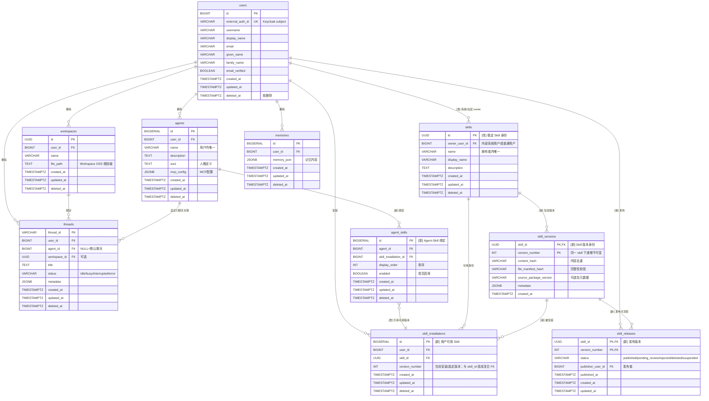
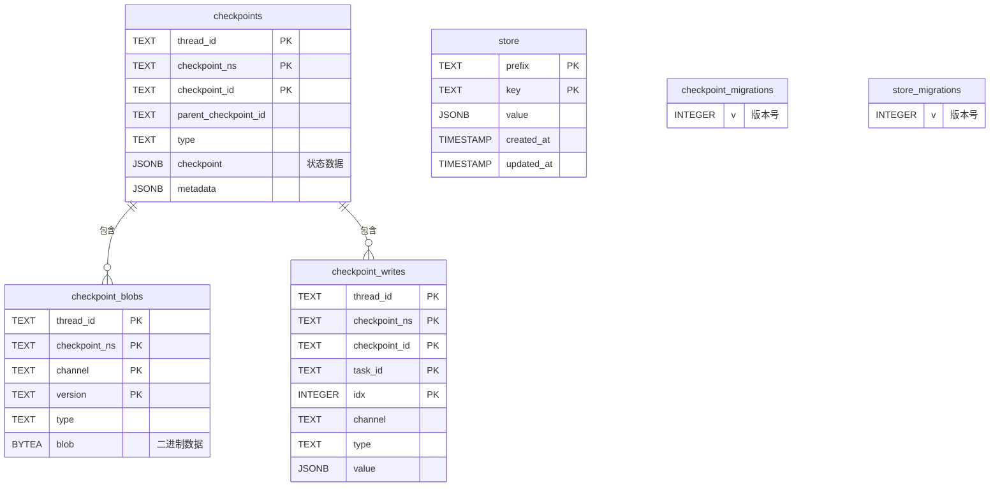

# DeerFlow 数据库 ER 图
## flow 数据库 ER 图

- 运行时文件与 Skill 内容由 Docker 容器内挂载的对象存储目录提供，不单独建文件内容表，因此不存在 `workspace_files` 实体。
- 默认聊天不是 default agent：`threads.agent_id = NULL` 表示默认聊天；`threads.agent_id` 非空表示自定义 Agent 聊天。
- 默认聊天启用的系统 Skill 来自平台级 `config.yaml`：`default_chat.system_skills: [{skill_id, version_number}]`。这是全局配置，只允许引用内部系统用户拥有的 Skill，不产生 `skill_installation`，也不需要启用关系表。

### flow ER 图变更标记

- 【修改】`skills.id` 改为 UUID，用于表达稳定 Skill 身份；系统 Skill 和社区 Skill 使用同一模型，系统 Skill 是内部系统用户拥有的普通 Skill。
- 【新增】`skill_versions` 依附 `skills`，版本身份为 `(skill_id, version_number)`；`version_number` 是同一 Skill 下递增且不可变的版本号。
- 【新增】`skill_releases` 保留，表示某个 `(skill_id, version_number)` 的发布、公开、审核可见性；发现、install、update 只选择 `status="published"` 的 release。
- 【新增】Skill 版本内容的 OSS 路径固定由 `(skill_id, version_number)` 派生为 `.deer-flow/skills/{skill_id}/{version_number}/`，不写入 DB 字段。
- 【新增】自定义 Agent 的绑定链路为 `agents -> agent_skills -> skill_installations -> skill_versions`。
- 【约束】`agent_skills.agent_id` 与 `agent_skills.skill_installation_id` 必须解析到同一用户：`agents.user_id = skill_installations.user_id`。
- 【新增】默认聊天系统 Skill 来自平台级 `config.yaml` 的 `default_chat.system_skills: [{skill_id, version_number}]`，只允许引用内部系统用户拥有的 Skill，不产生 `skill_installation`、`install_origin` 或 `skill_binding`/启用关系表。
- 【说明】`threads.agent_id` 空值表示默认聊天，非空表示自定义 Agent 聊天；`agents` 不设计 `kind` 字段。
- 【改名】旧口径 `skill_users` 名字不清晰，表名采用 `skill_installations`；旧口径 `skill_agent` 名字不清晰，表名采用 `agent_skills`。
- 【改名】旧字段 `skill_user_id` 名字不清晰，字段采用 `skill_installation_id`。
- 【删除】`oss_path` / `storage_uri` 字段：Skill 内容路径只能由 `(skill_id, version_number)` 派生，不能作为 `skill_versions` 或其他业务表字段保存。
- 【删除】旧 `skills.file_path` 当前生效版本路径口径，版本路径归属到不可变的派生目录 `.deer-flow/skills/{skill_id}/{version_number}/`。

---

## check_point 数据库 ER 图

---
