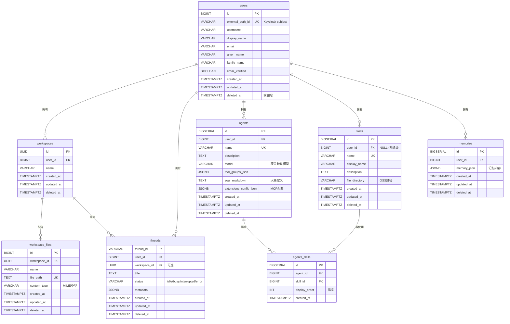
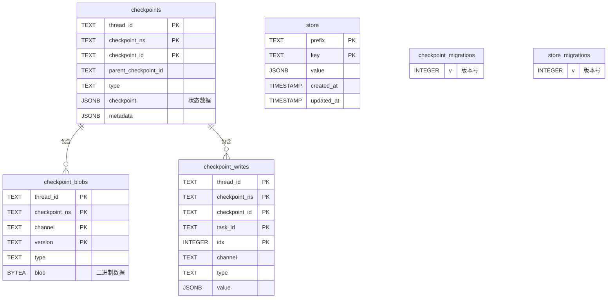

# DeerFlow 数据库 ER 图
## flow 数据库 ER 图

```mermaid
erDiagram
    users ||--o{ workspaces : "拥有"
    users ||--o{ threads : "拥有"
    users ||--o{ agents : "拥有"
    users ||--o{ skills : "拥有"
    users ||--o{ memories : "拥有"
    
    workspaces ||--o{ workspace_files : "包含"
    workspaces ||--o{ threads : "绑定"
    
    agents ||--o{ agents_skills : "绑定"
    skills ||--o{ agents_skills : "被使用"
    
    users {
        BIGINT id PK
        VARCHAR external_auth_id UK "Keycloak subject"
        VARCHAR username
        VARCHAR display_name
        VARCHAR email
        VARCHAR given_name
        VARCHAR family_name
        BOOLEAN email_verified
        TIMESTAMPTZ created_at
        TIMESTAMPTZ updated_at
        TIMESTAMPTZ deleted_at "软删除"
    }
    
    workspaces {
        UUID id PK
        BIGINT user_id FK
        VARCHAR name
        TIMESTAMPTZ created_at
        TIMESTAMPTZ updated_at
        TIMESTAMPTZ deleted_at
    }
    
    workspace_files {
        BIGINT id PK
        UUID workspace_id FK
        VARCHAR name
        TEXT file_path UK
        VARCHAR content_type "MIME类型"
        TIMESTAMPTZ created_at
        TIMESTAMPTZ updated_at
        TIMESTAMPTZ deleted_at
    }
    
    threads {
        VARCHAR thread_id PK
        BIGINT user_id FK
        UUID workspace_id FK "可选"
        TEXT title
        VARCHAR status "idle/busy/interrupted/error"
        JSONB metadata
        TIMESTAMPTZ created_at
        TIMESTAMPTZ updated_at
        TIMESTAMPTZ deleted_at
    }
    
    agents {
        BIGSERIAL id PK
        BIGINT user_id FK
        VARCHAR name UK
        TEXT description
        VARCHAR model "覆盖默认模型"
        JSONB tool_groups_json
        TEXT soul_markdown "人格定义"
        JSONB extensions_config_json "MCP配置"
        TIMESTAMPTZ created_at
        TIMESTAMPTZ updated_at
        TIMESTAMPTZ deleted_at
    }
    
    skills {
        BIGSERIAL id PK
        BIGINT user_id FK "NULL=系统级"
        VARCHAR name UK
        VARCHAR display_name
        TEXT description
        VARCHAR file_directory "OSS路径"
        TIMESTAMPTZ created_at
        TIMESTAMPTZ updated_at
        TIMESTAMPTZ deleted_at
    }
    
    agents_skills {
        BIGSERIAL id PK
        BIGINT agent_id FK
        BIGINT skill_id FK
        INT display_order "排序"
        TIMESTAMPTZ created_at
    }
    
    memories {
        BIGSERIAL id PK
        BIGINT user_id FK
        JSONB memory_json "记忆内容"
        TIMESTAMPTZ created_at
        TIMESTAMPTZ updated_at
        TIMESTAMPTZ deleted_at
    }
```

---

## check_point 数据库 ER 图

```mermaid
erDiagram
    checkpoints ||--o{ checkpoint_blobs : "包含"
    checkpoints ||--o{ checkpoint_writes : "包含"
    
    checkpoints {
        TEXT thread_id PK
        TEXT checkpoint_ns PK
        TEXT checkpoint_id PK
        TEXT parent_checkpoint_id
        TEXT type
        JSONB checkpoint "状态数据"
        JSONB metadata
    }
    
    checkpoint_blobs {
        TEXT thread_id PK
        TEXT checkpoint_ns PK
        TEXT channel PK
        TEXT version PK
        TEXT type
        BYTEA blob "二进制数据"
    }
    
    checkpoint_writes {
        TEXT thread_id PK
        TEXT checkpoint_ns PK
        TEXT checkpoint_id PK
        TEXT task_id PK
        INTEGER idx PK
        TEXT channel
        TEXT type
        JSONB value
    }
    
    store {
        TEXT prefix PK
        TEXT key PK
        JSONB value
        TIMESTAMP created_at
        TIMESTAMP updated_at
    }
    
    checkpoint_migrations {
        INTEGER v "版本号"
    }
    
    store_migrations {
        INTEGER v "版本号"
    }
```

---

