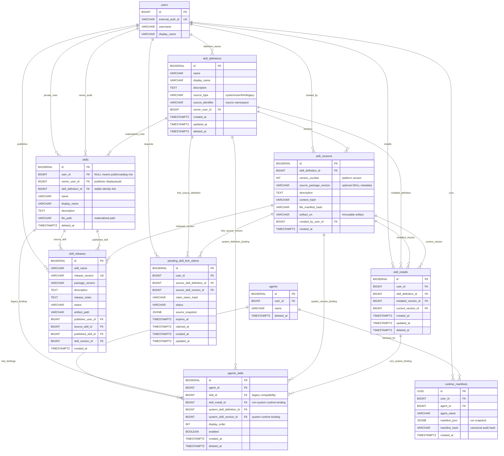
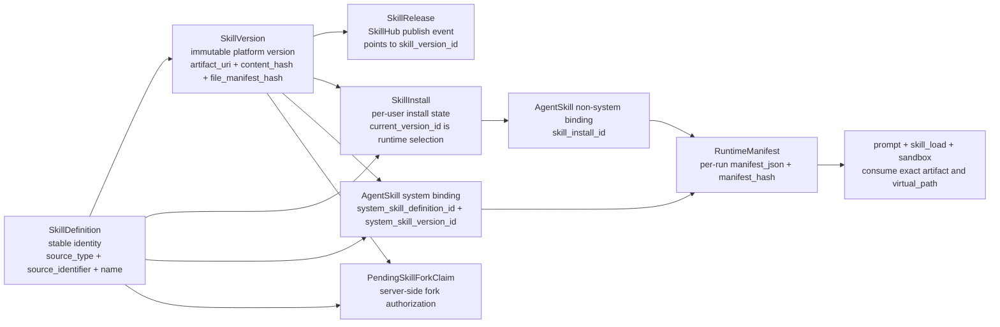

# DeerFlow 数据库 ER 图：skill-version 结构变化

日期：2026-05-11

本文基于当前 feature 分支相对 `origin/dev` / dev 的 `backend/app/gateway/db/models.py` 差异整理，只聚焦 skill-version、SkillHub 发布、Agent 绑定和 Runtime Manifest 相关数据库结构。它不是全量产品 ER 图，也不覆盖 checkpoint 数据库。

## 相对 dev 的结构变化

`origin/dev` 中 Skills 运行主要依赖 `skills` 和 `agents_skills.skill_id`：

- `skills` 表保存系统/用户 Skill 的 materialized row 和文件路径。
- `agents_skills.skill_id` 是 Agent 到 Skill 的绑定入口，且在 dev 中为非空。

当前 feature 分支把运行时真相迁移到 manifest-era 结构：

- 新增 `skill_definitions`：稳定 Skill 身份，身份键是 active `(source_type, source_identifier, name)`。
- 新增 `skill_versions`：不可变内容版本，保存平台版本号、artifact 路径和内容/hash。
- 新增 `skill_installs`：用户安装态，`current_version_id` 决定后续 run 选择的版本。
- 新增 `skill_releases`：发布事件，记录哪一次 SkillHub 发布指向了哪个 `skill_version_id`。
- 新增 `pending_skill_fork_claims`：server-side fork 授权 claim，支撑导出包后续上传认领。
- 新增 `runtime_manifests`：单次 run 的授权快照，保存 `manifest_json` 和确定性 `manifest_hash`。
- 变更 `skills`：新增 `skill_definition_id`，并保留 `owner_user_id` 作为发布者/display/audit 字段。
- 变更 `agents_skills`：`skill_id` 变为兼容字段；新增 `skill_install_id`、`system_skill_definition_id`、`system_skill_version_id`，并用 check constraint 要求 active binding 至少有一种 Skill 入口。

## Skill-version 聚焦 ER



## Agent runtime 绑定流



## 核心语义

- Definition identity：`SkillDefinition` 是稳定身份，不是内容版本；同名 Skill 必须由 `(source_type, source_identifier, name)` 区分来源。
- Immutable Version：`SkillVersion` 是不可变内容快照；`version_number` 是 DeerFlow 平台版本，`source_package_version` 只是包内 metadata。
- Release publish event：`SkillRelease` 是发布事件，指向具体 `skill_version_id`；发布新版不会原地覆盖旧 artifact。
- Install current version：`SkillInstall.current_version_id` 是用户当前运行选择；作者发布新版不会自动改写安装者的安装态。
- AgentSkill binding split：非系统 Skill 绑定 `skill_install_id`；System Skill 直接绑定 `system_skill_definition_id` / `system_skill_version_id`，不需要 per-user install row。
- RuntimeManifest run snapshot：`runtime_manifests.manifest_json` 固化单次 run 的具体 SkillVersion、artifact、hash、virtual path 和 binding identity；`manifest_hash` 是用于审计的确定性 hash。
- ForkClaim server-side authorization：`pending_skill_fork_claims` 把导出包中的 claim token 与源 `SkillDefinition` / `SkillVersion` 绑定，避免客户端单靠包内容声明 fork 来源。

## 兼容边界

`skills` 和 `agents_skills.skill_id` 仍保留用于 legacy/materialized catalog/private row、旧调用方和迁移兼容，但它们不是 manifest-era skill-version 运行时真相。

新版运行时应沿以下路径解析：

```text
非系统 Skill:
agents_skills.skill_install_id
  -> skill_installs.current_version_id
  -> skill_versions.artifact_uri
  -> runtime_manifests.manifest_json

System Skill:
agents_skills.system_skill_version_id
  -> skill_versions.artifact_uri
  -> runtime_manifests.manifest_json
```

不应再从 `skills.name`、`agents_skills.skill_id`、public latest、custom copy 或同名目录扫描中重新推导运行版本。
