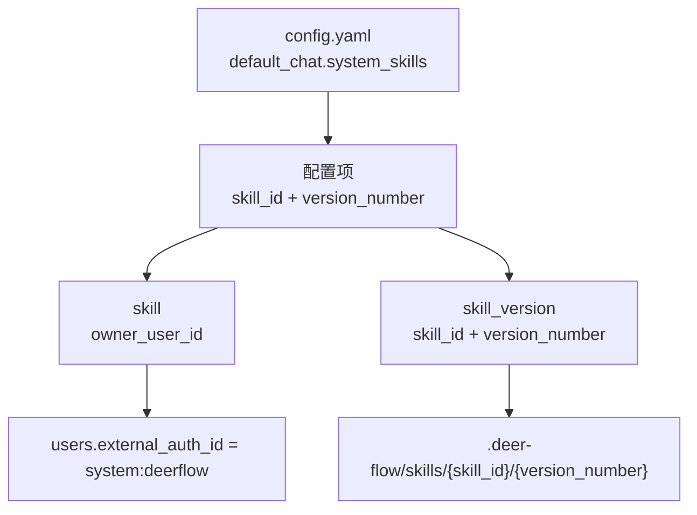
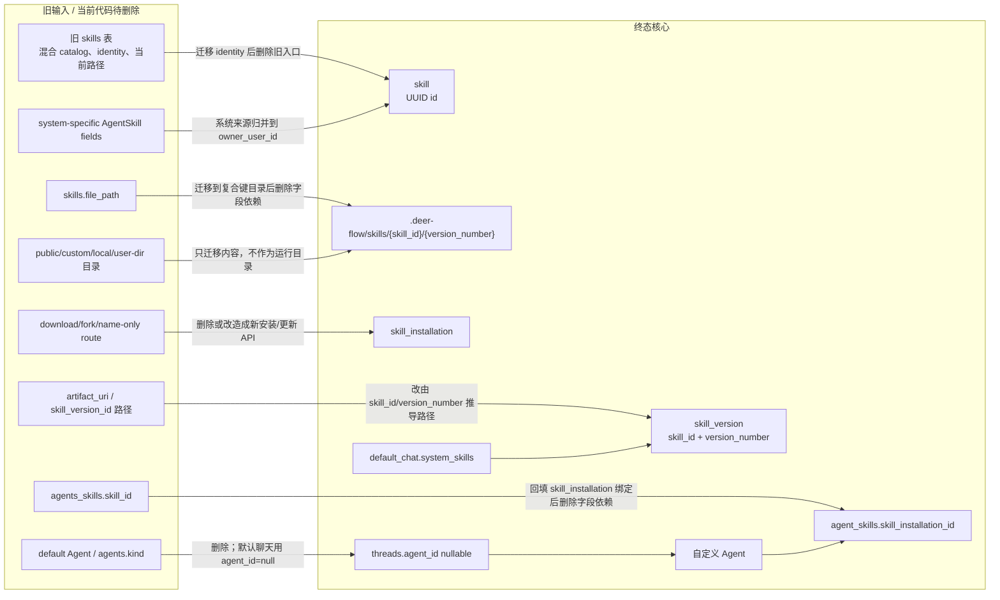

# Skill Version 新模式 DB ER 设计

日期：2026-05-12

状态：终态收口版；本文只表达终态最小核心关系。

## 阅读来源与命名口径

本文对齐以下终态基准：

1. `docs-qy/skills-new/00-terminal-state.md`
2. `docs-qy/skills-new/flows/03-core-relationship-diagrams.md`
3. `docs-qy/skills-new/10-default-system-skill-install.md`

下文统一使用收口后的概念名：

| 终态概念 | 当前实现/文档中的近似对象 | 说明 |
| -------- | ------------------------- | ---- |
| `skill` | `skill_definitions` | 稳定 Skill 身份，终态 `id` 为 UUID |
| `skill_version` | `skill_versions` | 不可变内容版本，身份为 `(skill_id, version_number)` |
| `skill_releases` | `skill_releases` | 某个版本的发布 / 公开 / 审核可见性 |
| `skill_installation` | `skill_installs` | 用户可用关系 / 安装态，保存当前运行版本号 |
| `agent_skills` | `agents_skills` | 自定义 Agent 启用关系 |

这张表只是为了把当前代码/旧文档映射到新概念。终态 ER 只使用 `skill`、`skill_version`、`skill_releases`、`skill_installation`、`agent_skills`；旧 `skills` 表只作为迁移输入和待删除对象，不进入终态模型。

改名说明：旧口径 `skill_users` / `skill_agent` 名字不清晰，终态采用 `skill_installations` / `agent_skills`；旧字段 `skill_user_id` 终态采用 `skill_installation_id`。旧名只允许出现在改名说明、历史问题或待删除语境。

本文不展开 `workspaces`、`memories`、LangGraph checkpoint 等与 Skill runtime 授权无关的表。

## 终态最小 DB ER

```mermaid
erDiagram
    users ||--o{ skills : "owns"
    users ||--o{ skill_installations : "has_available_skill"
    users ||--o{ agents : "owns_custom_agent"

    skills ||--o{ skill_versions : "has_versions"
    skills ||--o{ skill_installations : "available_identity"
    skill_versions ||--o{ skill_releases : "[新] 发布可见性"
    skill_versions ||--o{ skill_installations : "current_runtime_version"

    agents ||--o{ agent_skills : "has_enabled_skill"
    skill_installations ||--o{ agent_skills : "binding_source"
    agents ||--o{ threads : "runs_custom_thread"

    users {
        BIGINT id PK
        VARCHAR external_auth_id
    }

    skills {
        UUID id PK
        BIGINT owner_user_id FK
        VARCHAR name
    }

    skill_versions {
        UUID skill_id PK FK
        INT version_number PK
        VARCHAR content_hash
        VARCHAR file_manifest_hash
    }

    skill_releases {
        UUID skill_id PK FK
        INT version_number PK
        VARCHAR status "published/pending_review/rejected/delisted/suspended"
        BIGINT publisher_user_id FK
        TIMESTAMPTZ published_at
        TIMESTAMPTZ created_at
    }

    skill_installations {
        BIGINT id PK
        BIGINT user_id FK
        UUID skill_id FK
        INT version_number
    }

    agents {
        BIGINT id PK
        BIGINT user_id FK
    }

    agent_skills {
        BIGINT id PK
        BIGINT agent_id FK
        BIGINT skill_installation_id FK
    }

    threads {
        VARCHAR thread_id PK
        BIGINT agent_id FK "nullable"
    }
```

这张图只表达 DB 中的运行和业务事实来源：

1. `skill.id` 是 UUID，表达稳定 Skill 身份。
2. `skill_version` 的身份是 `(skill_id, version_number)`，不能独立于 `skill` 存在。
3. 物理目录由 `(skill_id, version_number)` 推导为 `.deer-flow/skills/{skill_id}/{version_number}/`。
4. `skill_releases` 保留，表示某个 `(skill_id, version_number)` 的发布、公开、审核可见性；`status` 控制 discovery、install、update 目标，不改变版本内容。
5. `skill_installation.version_number` 是某个用户当前运行版本的核心选择。
6. `agent_skills` 绑定 `skill_installation`，不直接绑定版本，也不从名称、目录或旧行反推。
7. `threads.agent_id` 可空；空值表示默认聊天，非空表示自定义 Agent 聊天。

### ER 图变更标记

- 【新增】`skill_releases` 进入 ER，表示某个 `(skill_id, version_number)` 的发布、公开、审核可见性；发现、install、update 只选择 `status="published"` 的 release。
- 【改名】旧口径 `skill_users` 名字不清晰，终态表名采用 `skill_installations`；旧口径 `skill_agent` 名字不清晰，终态表名采用 `agent_skills`。
- 【删除】`oss_path` / `storage_uri` 字段：路径只能由 `(skill_id, version_number)` 派生，不能作为 DB 字段保存。

## 平台配置不是 DB 关系

默认聊天系统 Skill 不进入上面的 DB ER 关系链。

平台配置形如：

```yaml
default_chat:
  system_skills:
    - skill_id: "00000000-0000-0000-0000-000000000000"
      version_number: 1
```

配置项引用 DB 中已有的 `(skill_id, version_number)`，但不产生新的 DB 关系。



配置约束：

1. `skill_id` 必须存在。
2. `skill.owner_user_id` 必须指向内部系统用户。
3. `(skill_id, version_number)` 必须存在。
4. 不写入 `skill_installation`。
5. 不写入 `agent_skills`。
6. 不需要 `install_origin`。
7. 不创建 default Agent。

## 字段级最小性

| 字段 | 不可替代作用 |
| ---- | ------------ |
| `users.id` | 所有用户归属关系的内部 FK 锚点，外部登录标识不能替代引用完整性 |
| `users.external_auth_id` | 稳定识别内部系统用户，如 `system:deerflow`，避免硬编码数字主键 |
| `skill.id` | 稳定 Skill identity 的 UUID FK 锚点 |
| `skill.owner_user_id` | 表达作者/官方 owner 和发布权限来源，同名 Skill 先由 owner 分开 |
| `skill.name` | 同一 owner 下的稳定业务名；目录不再承担 identity |
| `skill_version.skill_id` | 版本所属 Skill，也是 `.deer-flow/skills/{skill_id}` 目录层 |
| `skill_version.version_number` | 同一 Skill 下的平台版本序号，也是目录第二层；不可变且递增 |
| `skill_version.content_hash` | 同一 Skill 下复用相同内容，避免重复生成平台版本 |
| `skill_version.file_manifest_hash` | runtime 前完整性校验，证明目录内容未漂移 |
| `skill_releases.skill_id` | release 指向的 Skill |
| `skill_releases.version_number` | release 指向的不可变版本 |
| `skill_releases.status` | 控制 discover/install/update 是否可见，不能从版本本身推导 |
| `skill_releases.publisher_user_id` | 可选发布者 FK；系统用户发布可 auto-published，普通社区作者第一轮可 published，二期可 pending_review |
| `skill_releases.published_at` | 可选公开时间，不参与 runtime 路径授权 |
| `skill_installation.id` | `agent_skills` 绑定的稳定用户可用关系 FK |
| `skill_installation.user_id` | 表达哪个用户拥有这条可用关系，同一版本可被多个用户使用 |
| `skill_installation.skill_id` | 保证一个用户对同一 Skill identity 只有一个可用关系 |
| `skill_installation.version_number` | 用户当前选择的 runtime 版本；发布新版不能静默改变它 |
| `agents.id` | 自定义 Agent 和 `agent_skills` 的 FK 锚点 |
| `agents.user_id` | Agent ownership 和运行前权限校验 |
| `agent_skills.id` | 单条启用关系的稳定行身份 |
| `agent_skills.agent_id` | 表达哪个自定义 Agent 启用了 Skill |
| `agent_skills.skill_installation_id` | 统一绑定用户可用关系 |
| `threads.thread_id` | 对话运行入口身份，Agent 不能唯一标识一次对话 |
| `threads.agent_id` | nullable；null 是默认聊天，非空是自定义 Agent 聊天 |

不进入核心 ER 的内容：

| 对象或字段 | 移出原因 |
| ---------- | -------- |
| `skill_version_id` | 版本身份是 `(skill_id, version_number)`，不需要独立身份 |
| `artifact_uri` | 运行路径固定由 `(skill_id, version_number)` 推导，重复保存会产生漂移 |
| `oss_path` / `storage_uri` | 路径只能由 `(skill_id, version_number)` 派生，不能作为 DB 字段保存 |
| public latest copy | 公开发现靠 `skill_releases.status`，不复制一份 latest 内容作为事实来源 |
| `install_origin` | 默认聊天系统 Skill 不产生 `skill_installation`，终态最小模型不需要安装来源字段 |
| `agents.kind` / `agent.kind` | 默认聊天不是 Agent，不需要 default/custom Agent 枚举 |
| 展示资料、时间戳、软删除字段 | 属于展示、排序、审计或迁移策略，不参与 runtime 授权 |
| 包 metadata / `SKILL.md` package version | 不决定平台版本、去重、目录或授权 |
| 运行审计快照 | 只能记录 resolver 已决定的结果，不能参与 prompt、sandbox、`skill_load` 授权 |

## 最小约束

1. `skill.id` 是 UUID。
2. `skill` 对 `(owner_user_id, name)` 唯一。
3. `skill_version` 对 `(skill_id, version_number)` 唯一，且该组合是版本身份。
4. `version_number` 在同一 `skill_id` 下递增且不可变。
5. `skill_version` 对 `(skill_id, content_hash)` 唯一或具备等价去重保证。
6. `skill_releases(skill_id, version_number)` 必须指向存在的 `skill_version`；只有 `status="published"` 参与 discovery/install/update。
7. publish 流程必须先确保或创建 `skill_version(skill_id, version_number)` 和 `.deer-flow/skills/{skill_id}/{version_number}/` 内容目录，再创建或更新 `skill_releases(skill_id, version_number, status)`。
8. `skill_installation` 对 `(user_id, skill_id)` 唯一。
9. `skill_installation.version_number` 必须属于同一 `skill_id`。
10. `agent_skills` 对 `(agent_id, skill_installation_id)` 唯一。
11. `threads.agent_id` 可空；空值是终态默认聊天语义，不应被迁移成 default Agent。
12. `default_chat.system_skills` 每项必须至少引用内部系统用户拥有且存在的 `(skill_id, version_number)`；是否要求引用 `published` 系统 release 是策略选择。

## 旧 ER 差距点和待删除点

旧 dev/root ER、当前 feature ER 文档和旧目录只用于识别迁移成本。它们不能进入新终态能力，也不能成为运行补齐路径。



## 运行约束

默认聊天解析必须遵循：

```text
Thread(agent_id=null)
  -> default_chat.system_skills
  -> skill_versions(skill_id, version_number)
  -> .deer-flow/skills/{skill_id}/{version_number}
  -> descriptor
```

自定义 Agent 解析必须遵循：

```text
Thread(agent_id)
  -> Agent
  -> agent_skills
  -> skill_installations
  -> skill_versions(skill_id, version_number)
  -> .deer-flow/skills/{skill_id}/{version_number}
  -> descriptor
```

内部系统用户只能通过稳定登录标识定位：

```text
users.external_auth_id = "system:deerflow"
```

## Review 检查点

1. ER block 只出现 `users`、`skills`、`skill_versions`、`skill_releases`、`skill_installations`、`agents`、`agent_skills`、`threads`。
2. `skill.id` 是 UUID。
3. `skill_version` 没有独立于 `skill` 的 ID。
4. 目录必须是 `.deer-flow/skills/{skill_id}/{version_number}/`。
5. `threads.agent_id` nullable，null 是默认聊天。
6. 默认聊天 config 不产生 DB 关系。
7. prompt、sandbox、`skill_load` 只消费 descriptor，不读取旧表、旧目录或审计快照来决定授权。
