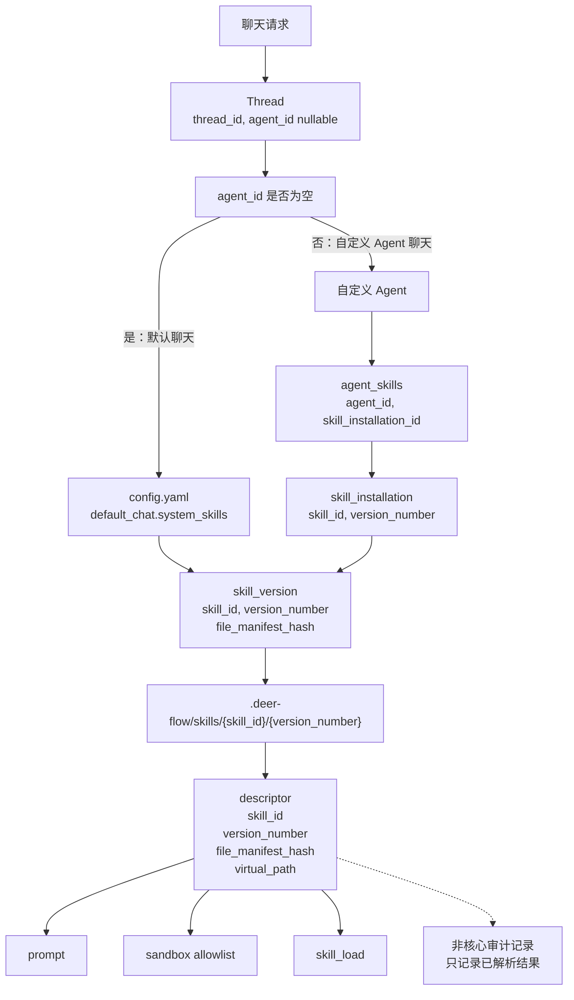
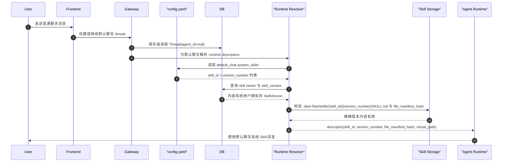
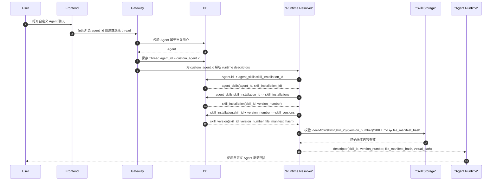
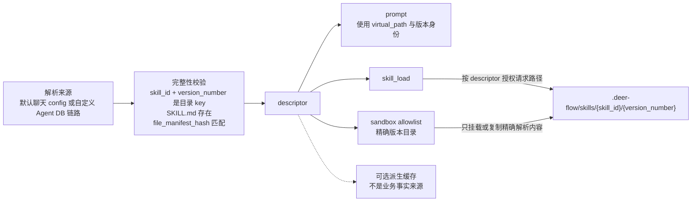
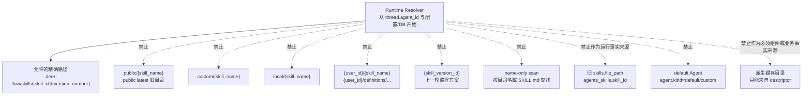

# Skill Version 新模式 Agent 运行时设计

日期：2026-05-12

状态：终态收口版；本文表达默认聊天和自定义 Agent 的两条入口、一种 descriptor。

## 命名口径

本文统一使用 `03-core-relationship-diagrams.md` 的概念名：

| 终态概念 | 当前实现/文档中的近似对象 | runtime 含义 |
| -------- | ------------------------- | ------------ |
| `skill` | `skill_definitions` | 稳定 Skill 身份，`id` 是 UUID |
| `skill_version` | `skill_versions` | 不可变内容版本，身份是 `(skill_id, version_number)` |
| `skill_installation` | `skill_installs` | 用户可用关系 / 安装态，保存当前版本号 |
| `agent_skills` | `agents_skills` | 自定义 Agent 启用关系 |

上表只是实现映射。运行设计只讨论终态概念链路，不把旧 `skills` 表、旧目录、旧 route、default Agent 或 manifest JSON 写成可运行能力。

改名说明：旧口径 `skill_users` / `skill_agent` 名字不清晰，终态采用 `skill_installations` / `agent_skills`；旧字段 `skill_user_id` 终态采用 `skill_installation_id`。旧名只允许出现在改名说明、历史问题或待删除语境。

## 结论

运行时有两个入口：

```text
Thread(agent_id=null)  -> 默认聊天
Thread(agent_id!=null) -> 自定义 Agent 聊天
```

默认聊天不解析 Agent，不创建 default Agent，也不读取 `agent_skills`。

默认聊天链路：

```text
Thread(agent_id=null)
  -> default_chat.system_skills
  -> validate internal system User ownership
  -> skill_versions(skill_id, version_number)
  -> .deer-flow/skills/{skill_id}/{version_number}
  -> descriptor(skill_id, version_number, file_manifest_hash, virtual_path)
  -> prompt / sandbox / skill_load
```

自定义 Agent 链路：

```text
Thread(agent_id)
  -> Agent
  -> agent_skills
  -> skill_installations
  -> skill_versions(skill_id, version_number)
  -> .deer-flow/skills/{skill_id}/{version_number}
  -> descriptor(skill_id, version_number, file_manifest_hash, virtual_path)
  -> prompt / sandbox / skill_load
```

两条入口最终生成同一种 descriptor。runtime 不按系统/社区/用户来源分支，也不通过名称、旧表或目录扫描补齐 Skill。

`skill_releases` 保留，但属于 runtime 选择前的发现、install、update 可见性层。发现、install、update 只选择 `status="published"` 的 release；runtime 已经拿到具体 `(skill_id, version_number)` 后不通过 release 找目录，release 不参与路径授权。

## 总体解析图



这张图的关键约束：

1. 默认聊天从 `thread.agent_id=null` 开始，不存在 default Agent。
2. 自定义 Agent 从非空 `thread.agent_id` 开始。
3. 默认聊天 Skill 来源是平台 config。
4. 自定义 Agent Skill 来源是 `agent_skills -> skill_installations`。
5. 物理内容目录由 `(skill_id, version_number)` 推导。
6. prompt、sandbox allowlist、`skill_load` 消费同一个 descriptor shape。
7. `skill_releases` 不在 descriptor 解析链路上；release 只决定 runtime 前的可见性和可安装/可更新目标。

## 默认聊天 runtime



规则：

1. 默认聊天 thread 的 `agent_id` 保持 `null`。
2. 缺失 config 可按产品策略降级为空系统 Skill 或启动失败；不能创建 default Agent 补齐。
3. 配置项必须指向内部系统用户拥有的 Skill。
4. 配置项必须是精确 `(skill_id, version_number)`。
5. 默认聊天不能扫描全局 Skill 来补齐。
6. 默认聊天不能创建 `skill_installation`、`agent_skills` 或 `install_origin`。

## 自定义 Agent 聊天



自定义 Agent runtime 不能有第二套 Skill 模型。系统 Skill 如果未来允许进入自定义 Agent，也必须通过业务链路获得 `skill_installation` 后再绑定；runtime 不增加系统直连分支。

## Prompt、sandbox 和 skill_load



descriptor 最小字段只包含 prompt、sandbox allowlist、`skill_load` 三者共同需要的授权输入：

| 字段 | 来源 | runtime 用途 |
| ---- | ---- | ------------ |
| `skill_id` | 默认聊天 config 或 `skill_installation.skill_id` | 稳定 Skill 身份和目录第一层 |
| `version_number` | 默认聊天 config 或 `skill_installation.version_number` | 不可变版本和目录第二层 |
| `file_manifest_hash` | `skill_version.file_manifest_hash` | 在 prompt、sandbox 或 `skill_load` 前做完整性校验 |
| `virtual_path` | Resolver 根据精确绑定生成 | 面向模型的稳定路径；同名 Skill 必须避免冲突 |

不进入最小 descriptor 的内容：

1. `skill_installation_id`：resolver 可以内部使用，但 prompt、sandbox、`skill_load` 授权只需要已解析出的版本身份。
2. 独立路径字段：终态路径固定由 `(skill_id, version_number)` 推导，不携带第二份路径事实。
3. `display_name` / `description`：展示文案，不参与授权；如 prompt 要展示名称，应由应用层另行组装非授权文案。
4. 派生缓存路径：只能由 descriptor 生成，不能成为必须组件或业务事实来源。

`skill_load` 授权规则：

```text
requested path 只有解析到某个 descriptor 对应的精确版本内容根目录或派生只读缓存下时才允许读取
```

## 非核心审计记录

运行链路不依赖审计记录。若后续需要记录本次 resolver 结果用于排查或历史 run 查看，只能遵守：

1. 记录 resolver 已经选定的 descriptor。
2. 不参与 prompt、sandbox 或 `skill_load` 授权。
3. 不能通过回放旧 JSON 修复缺失的 DB 关系或配置。
4. 缺失审计记录时，只要 descriptor 已解析，runtime 可继续。

## 禁止的旧入口



禁止模式：

1. 解析失败时读取 public/latest。
2. 读取 `custom/`、`local/` 或 `{user_id}` 目录来补齐运行内容。
3. 通过 Skill 同名目录、同名 `SKILL.md` 或 name-only 查找定位 Skill。
4. 递归扫描 `.deer-flow/skills` 来发现一次 run 的可用 Skills。
5. 把 `skills.file_path` 或 `agents_skills.skill_id` 当成新的运行事实来源。
6. 把 `{skill_version_id}` 目录当成终态目录。
7. 把 default Agent 当成默认聊天补齐机制。
8. 把派生缓存目录当成业务存储，或把它写成 runtime 必须经过的链路节点。

## 失败行为

| 失败场景 | runtime 结果 |
| -------- | ------------ |
| 默认聊天 config 缺失 | 按产品策略明确失败或空配置运行；不能创建 default Agent 或扫描目录 |
| 默认聊天 config 指向非系统 owner Skill | 明确失败 |
| 默认聊天 config 指向不存在版本 | 明确失败 |
| 自定义 Agent 不存在或不属于该用户 | 明确失败；不能读取 public/default Skill 补齐 |
| `agent_skills.skill_installation_id` 缺失或无效 | 明确失败或由迁移任务提前修复；不能从 name 合成绑定 |
| `skill_installation` 不存在或属于其他用户 | 明确失败 |
| `skill_installation.version_number` 缺失或指向另一个 Skill identity | 明确失败 |
| `(skill_id, version_number)` 无法解析到 `.deer-flow/skills/{skill_id}/{version_number}` | 明确失败 |
| 请求路径逃逸精确版本目录或派生缓存目录 | 明确失败 |
| `SKILL.md` 缺失或 `file_manifest_hash` 不匹配 | 在 prompt、sandbox、`skill_load` 前失败 |
| 审计记录缺失 | descriptor 已解析时 runtime 可继续 |

## 剩余实现不确定项

上面的 runtime 链路已固定。剩余只是实施顺序问题，不能改变终态模型：

1. `default_chat.system_skills` 是启动校验还是支持热 reload。
2. 旧 route、旧目录、旧绑定字段需要制定删除与迁移清理顺序。
3. RuntimeManifest 是否保留为非核心审计记录。

## Review 检查点

1. 默认聊天和自定义 Agent 使用同一个 descriptor shape。
2. 默认聊天没有 default Agent、`skill_installation`、`agent_skills`、`install_origin`。
3. 自定义 Agent 仍走 `Thread -> Agent -> agent_skills -> skill_installations -> skill_versions`。
4. Prompt、sandbox allowlist 和 `skill_load` 消费同一个精确版本 descriptor。
5. 非核心审计记录不决定版本选择或授权。
6. Public/custom/local/user-dir/name-only/`skill_version_id` 旧入口明确禁止参与新版 runtime。
7. Runtime 拿到 `(skill_id, version_number)` 后不通过 release 找目录，release 不参与路径授权。
