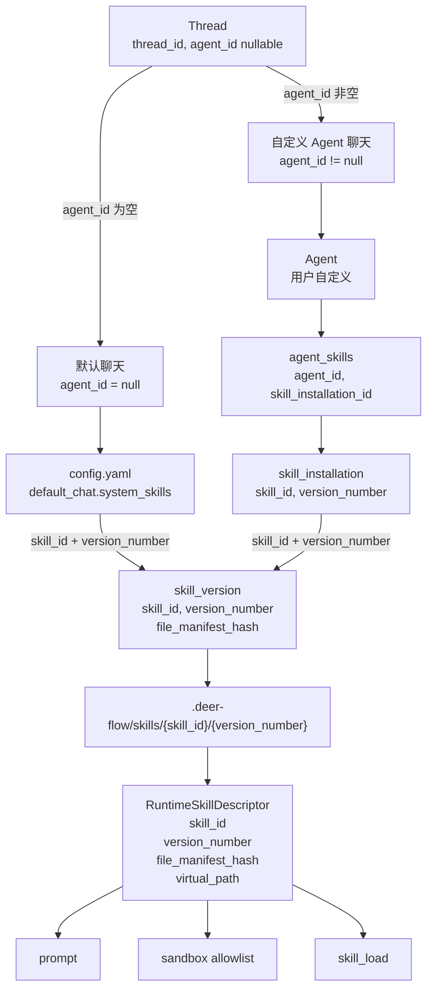
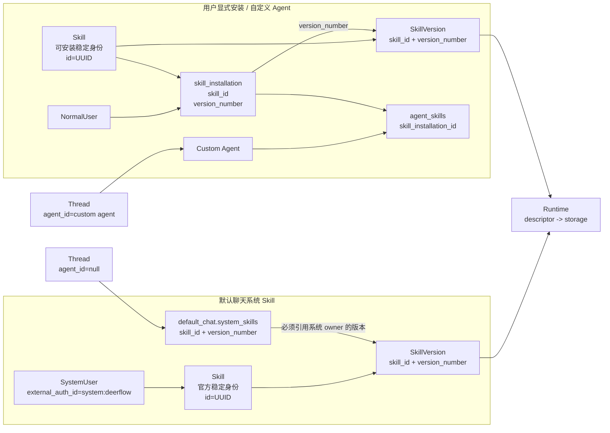

# Skill 核心关系图

日期：2026-05-12

本文用三张图说明 `skill`、`skill_version`、`skill_installation`、`agent_skills`、默认聊天配置和 Thread 的核心关系。这里使用的是收口后的概念名；为便于和 DB 设计文档互读，括号中仅标注当前实现中的近似对象名：

| 概念名 | 含义 | 当前近似对象 |
| ------ | ---- | ------------ |
| `skill` | 稳定 Skill 身份，`id` 是 UUID | `skill_definitions` |
| `skill_version` | 不可变内容版本，身份是 `(skill_id, version_number)` | `skill_versions` |
| `skill_releases` | 某个版本的发布 / 公开 / 审核可见性 | `skill_releases` |
| `skill_installation` | 用户可用关系 / 安装态，保存该用户当前使用的版本号 | `skill_installs` |
| `agent_skills` | 自定义 Agent 启用关系，表示某个 Agent 启用了某个用户可用 Skill | `agents_skills` |
| `default_chat.system_skills` | 平台级默认聊天系统 Skill 配置，不是 DB 绑定关系 | config.yaml |

改名说明：旧口径 `skill_users` / `skill_agent` 名字不清晰，终态采用 `skill_installations` / `agent_skills`；旧字段 `skill_user_id` 终态采用 `skill_installation_id`。旧名只允许出现在改名说明、历史问题或待删除语境。

## 1. 最小核心 ER 图

```mermaid
erDiagram
    users ||--o{ skills : "owns"
    users ||--o{ skill_installations : "has_available_skill"
    users ||--o{ agents : "owns_custom_agent"

    skills ||--o{ skill_versions : "has_versions"
    skills ||--o{ skill_installations : "available_identity"
    skill_versions ||--o{ skill_releases : "[新] 发布可见性"
    skill_versions ||--o{ skill_installations : "current_runtime_version"

    agents ||--o{ agent_skills : "has_enabled_skill"
    skill_installations ||--o{ agent_skills : "binding_source"
    agents ||--o{ threads : "runs_custom_thread"

    users {
        BIGINT id PK
        VARCHAR external_auth_id
    }

    skills {
        UUID id PK
        BIGINT owner_user_id FK
        VARCHAR name
    }

    skill_versions {
        UUID skill_id PK FK
        INT version_number PK
        VARCHAR content_hash
        VARCHAR file_manifest_hash
    }

    skill_releases {
        UUID skill_id PK FK
        INT version_number PK
        VARCHAR status "published/pending_review/rejected/delisted/suspended"
        BIGINT publisher_user_id FK
        TIMESTAMPTZ published_at
        TIMESTAMPTZ created_at
    }

    skill_installations {
        BIGINT id PK
        BIGINT user_id FK
        UUID skill_id FK
        INT version_number
    }

    agents {
        BIGINT id PK
        BIGINT user_id FK
    }

    agent_skills {
        BIGINT id PK
        BIGINT agent_id FK
        BIGINT skill_installation_id FK
    }

    threads {
        VARCHAR thread_id PK
        BIGINT agent_id FK "nullable"
    }
```

这张图说明：

1. `skill.id` 是 UUID，表达稳定 Skill 身份。
2. `skill_version` 不独立存在，版本身份是 `(skill_id, version_number)`。
3. `skill_releases` 保留，表示某个 `(skill_id, version_number)` 的发布、公开、审核可见性；发现、install、update 只选择 `status="published"` 的 release。
4. 删除的是 public latest copy、`artifact_uri` / `oss_path` / `storage_uri` 作为事实来源、独立 `skill_version_id` 版本身份，以及 fork/download 等旧语义，不是 release。
5. `skill_installation.version_number` 是用户当前运行版本的核心选择。
6. `agent_skills` 不直接绑定 `skill_version`，而是绑定 `skill_installation`，从而复用安装态里的版本选择。
7. `threads.agent_id` 为空表示默认聊天；非空表示自定义 Agent 聊天。
8. 默认聊天系统 Skill 配置不是 DB 关系，不出现在最小 ER 中。

### ER 图变更标记

- 【新增】`skill_releases` 进入 ER，表示某个 `(skill_id, version_number)` 的发布、公开、审核可见性；发现、install、update 只选择 `status="published"` 的 release。
- 【改名】旧口径 `skill_users` 名字不清晰，终态表名采用 `skill_installations`；旧口径 `skill_agent` 名字不清晰，终态表名采用 `agent_skills`。
- 【删除】`oss_path` / `storage_uri` 字段：路径只能由 `(skill_id, version_number)` 派生，不能作为 DB 字段保存。

## 2. 默认聊天 / 自定义 Agent 运行解析链路图



这张图说明：

1. 默认聊天不是 default Agent。
2. 默认聊天不使用 `skill_installation`、`agent_skills` 或 `install_origin`。
3. 自定义 Agent 仍使用完整业务链路。
4. 两条入口最终都解析到精确 `(skill_id, version_number)`。
5. 物理内容目录由版本复合身份推导为 `.deer-flow/skills/{skill_id}/{version_number}`。
6. prompt、sandbox allowlist、`skill_load` 消费同一个已解析 descriptor。
7. Runtime 已经拿到具体 `(skill_id, version_number)` 后不通过 `skill_releases` 找目录，release 不参与路径授权。

## 3. 系统默认配置 / 用户显式安装对比图



这张图说明：

1. 系统 Skill 由内部系统用户拥有，但默认聊天启用它时不生成目标用户的 `skill_installation`。
2. 默认聊天配置是平台全局 config，不是用户级开关。
3. 用户显式安装落到 `skill_installation`，自定义 Agent 通过 `agent_skills.skill_installation_id` 使用它。
4. 两种来源进入 runtime 时都解析到同一种版本身份 `(skill_id, version_number)`。
5. 系统 Skill 发布新版后，默认聊天不会自动漂移；只有平台 config 显式改到新版才生效。
6. 用户显式安装的 Skill 发布新版后，用户仍通过更新流程切换 `version_number`。
